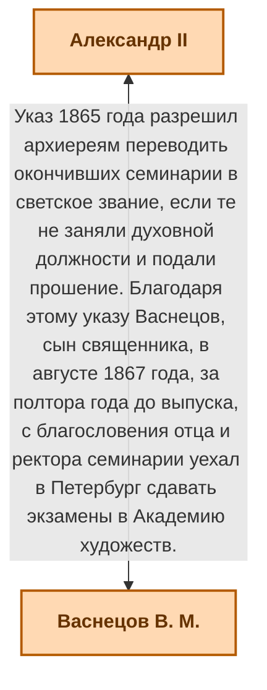
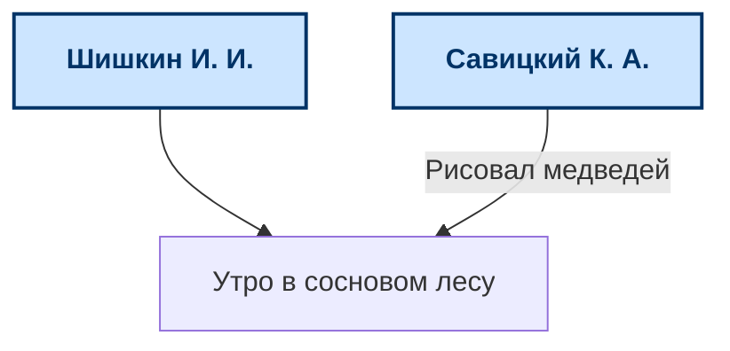

# History Map

Интерактивный инструмент визуализации графов для отображения исторических связей между людьми, событиями, произведениями искусства, документами и другими сущностями.

# Проблематика

История — это сеть взаимосвязанных событий, личностей и артефактов. Невозможно в полной мере отделить какое-либо историческое событие — все переплетено. Некоторые личности или события могут быть связаны самым неочевидным на первый взгляд способом.

Традиционные линейные тексты и статичные схемы не позволяют полноценно отразить эту сложность. Существующие инструменты либо слишком сложны для неспециалистов, либо не дают свободы в создании связей. Например википедия, не даёт нужного уровня визуализации. 

Человек усваивает визуальную информацию до нескольких раз лучше, чем простой текст, а поэтому данный проект позволит ускорить процесс обучения и понимания истории, а также простым образом отслеживать связанные события и сущности, путём перехода по связем.

# Задания проекта

- [x] Разработать модель веб-приложения (backend)
- [ ] Реализовать представление полученной модели (frontend)
- [ ] Выгрузить полученное решение на сервер
- [ ] Продемонстрировать работу систему, путём добавления информации о семье Васнецовых

# Функциональные требования

## Карта

Карта представляет собой интерактивное пространство, содержащее сущности и связи между ними.

Карта должна позволять:

- свободное перемещение по пространству
- масштабирование
- размещение сущностей
- создание связей между сущностями
- применение фильтров
- применение алгоритмов раскладки графа
- совместное редактирование

## Сущность

Сущность представляет любой объект, который может участвовать в исторических связях.

Примеры сущностей:

- историческая личность
- событие
- произведение искусства
- документ
- организация
- здание
- идея
- стиль

### Атрибуты сущности

Каждая сущность может или должна иметь следующие атрибуты:

- название (есть у всех сущностей)
- краткое описание (опционально, отображается на лицевой стороне карточки)
- изображение (опционально, отображается на карточке)
- статья (опционально, открывается в боковой панели).
- теги (опционально, пользовательские строки, неограниченное количество).
- прочие атрибуты и пользовательские характеристик (опционально)

Должна быть возможность перейти к статье, ассоциированной с сущностью, при её наличии

#### Прочие атрибуты

Помимо перечисленных выше атрибутов также можно добавлять следующие, атрибуты:

- годы жизни
- год создания
- дата начала и окончания события

***Все*** перечисленные выше атрибуты должны быть реализованы в системе по умолчанию

#### Пользовательские характеристики

Пользователь может создавать и добавлять произвольные атрибуты сущности.

Примеры:

- место рождения
- техника живописи
- исторический период

Такая система чем-то похожа на систему тегов, но в рамках атрибутов.

Система не накладывает ограничений на набор характеристик.


### Типы сущностей

Все сущности являются универсальными (то есть могут иметь любые атрибуты), однако система поддерживает шаблоны карточек для удобства создания.

Тип карточки влияет только на оформление лицевой стороны и набор изначальные атрибутов, которые можно заполнить при создании

Примеры шаблонов:

- личность — дополнительно годы жизни.
- картина — дополнительно автор и год создания.
- событие — дополнительно дата.
- место — дополнительно город и страна.

Пользователь может создавать собственные шаблоны карточек.

Шаблоны нужны только для удобства создания частовстречающихся сущностей и влияют только на интерфейс создания и отображения карточки, но не ограничивают структуру сущности. Пользователь может в любой момент добавить к сущности новые характеристики и атрибуты

### Отображение сущностей на карте

Сущности отображаются в виде карточек.

Карточка должна содержать:

- изображение (если есть)
- название
- основные характеристики

Размер карточки зависит от количества связей сущности.

Чем больше связей имеет сущность, тем больше её визуальный размер.

### Создание сущностей

Создание новой сущности возможно следующими способами:

- двойной клик по пустому месту карты
- горячая клавиша (сущность создаётся на месте текущего положения курсора)

При создании сущности пользователю предлагается выбрать шаблон карточки.

### Перемещение сущностей

Сущности можно перемещать по карте

### Удаление сущности

Сущность можно удалить.

При удалении сущности автоматически удаляются все связи, связанные с ней.

### Просмотр сущности

При двойном нажатии на карточку сущности на карте сущность — приближается центрирует холст на ней

На лицевой стороне должны отображаться все указанные атрибуты

При одиночном нажатии на карточку и должна быть возможность масштабировать ее размер на карте колёсиком мыши

## Статья

Любая сущность может иметь статью.

Статья представляет собой расширенное текстовое описание сущности.

Статья может содержать:

- текст
- изображения

В конце статьи автоматически отображается список связанных сущностей.

## Связь

Связь соединяет две сущности и отражает отношение между ними.

### Атрибуты связи

Связь должна иметь:

- исходную сущность
- целевую сущность
- описание
- направление

Описание и направление связи задаётся пользователем.

### Типы связей

Поддерживаются два типа связей:

#### Двусторонняя связь

Связывает две равноправные сущности.

Пример:




#### Односторонняя связь

Используется в случаях, когда одна сущность логически принадлежит другой.

Пример:



Описание такой связи может отсутствовать.


### Создание связей

Связь создаётся следующим образом:

1. пользователь выбирает первую сущность
2. удерживает клавишу Shift
3. выбирает вторую сущность

После этого создаётся связь между сущностями.

Пользователь может добавить описание связи.

### Редактирование связи

Клик по линии связи, открывается боковая панель с возможностью изменить описание и тип.

### Удаление связи

Клик по линии, нажать `Delete`.

### Визуализация

Двусторонние связи отображаются линией без стрелки, односторонние — стрелкой от «источника» к «цели».


## Фильтрация

Карта должна поддерживать фильтрацию.

Фильтры могут включать:

- фильтрацию по тегам
- фильтрацию по времени
- фильтрацию по расстоянию в графе

При применении фильтра отображаются только соответствующие сущности.

## Алгоритмы раскладки графа

Пользователь может применить автоматическую раскладку карты.

Поддерживаются различные алгоритмы раскладки:

- force-directed layout
- tree layout
- grid layout

Это позволяет автоматически организовывать структуру карты.

## Кластеризация

При большом количестве сущностей карта может группировать связанные узлы.

Пользователь может:

- скрывать кластеры
- разворачивать кластеры

## Совместная работа

Пользователь может пригласить других пользователей для совместного редактирования карты.

Редактирование происходит в реальном времени.

Система должна поддерживать синхронную работу нескольких пользователей.

## Взаимодействие с приложением

### Карта

- Бесконечная в обе стороны (поддерживается панорамирование зажатием пробела или перетаскиванием фона).
- Масштабирование колесом мыши (глобальное).
- Приближение к карточке: двойной клик по карточке (или кнопка на ней) — центрирует холст на ней
- Изменение размера отдельной карточки: навести курсор на карточку, крутить колёсико мыши — размер меняется (пропорционально тексту и изображению).
  
### Выделение:

- Клик по карточке — выделение (подсветка границ).
- Клик по пустому месту — сброс выделения.
- Множественное выделение: зажатый Ctrl + клики по карточкам (или рамка выделения).
- Перемещение выделенных карточек перетаскиванием.

### Работа с графом

Размер карточки автоматически зависит от количества связей (чем больше связей, тем крупнее карточка). 
- Формула: `базовый_размер` * (1 + log(`количество_связей` + 1)). 
  
Односторонние связи учитываются с половинным весом (или как 0.5).

Должны поддерживаться стандартные горячие клавиши

### Регистрация и сохранение

До регистрации карта хранится только в кеше. При выходе из браузера или перезагрузке созданная карта может потеряться

Для сохранения карты необходимо зарегистрироваться

## Каталог

Каталог содержит в себе список всех сущностей, автоматически группирует их по тегам и позволяет переходить по сущностям.

- Отдельная панель со списком всех сущностей, сгруппированных по тегам.
- По клику на тег — фильтрация карты по этому тегу.
- По клику на сущность — переход к ней на карте и открытие боковой панели.

Например, там могут быть следующие группы: "Личность", "Картина", "Событие". Пользователь может нажать на "Личность" и ему откроется список всех сущностей с соответствующим тегом. 

Если сущность имеет односторонние связи (например, добавляем художнику картины), то она сама становится подгруппой в каталоге и при нажатии на нее развернется список ассоциируемых "подсущностей"


# Нефункциональные требования

- Карта должна поддерживать *практически неограниченный размер*.
- Добавление и удаление атрибутов сущности должно ощущаться как конструктор и быть простым
- Приложение должно иметь луковую архитектуру с богатой доменной моделью. Бизнес-логика должна быть изолирована от инфраструктуры.
- Приложение должно следовать основным принципам разработки ПО, GRASP, SOLID, паттерны при необходимость

Система должна позволять:

- легко добавлять новые типы карточек
- легко добавлять связи между ними
- легко добавлять новые характеристики сущностей

Приложение должно сохранять производительность при большом количестве сущностей и связей.

Для этого могут использоваться:

- кеширование
- частичная подгрузка графа
- выгрузка неиспользуемых данных из памяти

Система должна поддерживать работу с графами большого размера.

Карта должна оставаться читаемой даже при большом количестве сущностей.

Для этого используются:

- изменение размеров карточек
- фильтрация
- кластеризация
- алгоритмы раскладки

# Технологический стек

## Frontend

- React
- TypeScript
- Cytoscape.js

## Backend

- Java
- Spring Boot

## Хранение данных

- ArangoDB — хранение графовой структуры
- PostgreSQL — хранение пользователей
- Redis — кеширование

## Установка и запуск

### Предварительные требования

- Установленные Docker и Docker Compose

### Запуск приложения

```bash
docker compose up --build
```

После запуска откройте в браузере: **http://localhost**

Автоматически поднимутся 5 сервисов:

| Сервис     | Порт |
|------------|------|
| Frontend   | 80   |
| Backend    | 8080 |
| PostgreSQL | 5432 |
| ArangoDB   | 8529 |
| Redis      | 6379 |

Данные сохраняются в Docker volumes и не теряются после перезапуска.

### ArangoDB Web UI (опционально)

Адрес: http://localhost:8529

Логин/пароль: `root` / `historymap`

### Остановка проекта

```bash
docker compose down
```
